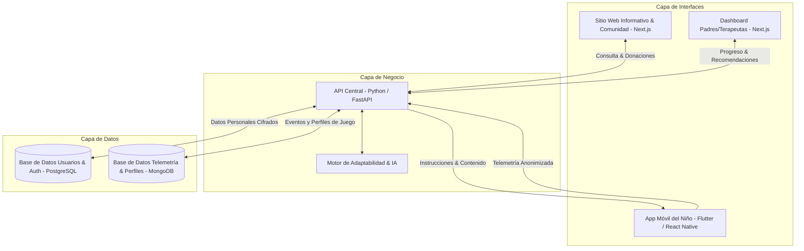

# Arquitectura del Sistema - Ecosistema Yarumito 🌳

Este documento describe la arquitectura de software, el flujo de datos y la pila tecnológica recomendada para construir el **Ecosistema Yarumito**. El sistema está diseñado para ser altamente modular, permitiendo que ingenieros de software, diseñadores pedagógicos y científicos de datos colaboren de forma independiente.

---

## 1. Vista de Alto Nivel (High-Level Architecture)

Yarumito se compone de 4 capas principales conectadas a través de una API central inteligente.



---

## 2. Detalle de Capas y Stack Tecnológico

### Capa 1: Sitio Web Informativo y Comunidad (`web/`)
* **Propósito**: Difusión de la misión, blog, transparencia financiera, portal de donaciones, descarga de la app y descarga de recursos físicos imprimibles.
* **Stack Recomendado**: **Next.js** (TypeScript) con **Vanilla CSS**.
* **Justificación**:
  - **SEO y Renderizado en Servidor (SSR)**: Crítico para que artículos sobre neurodiversidad e investigación científica se indexen en motores de búsqueda.
  - **Optimización de Rendimiento**: Tiempos de carga mínimos para optimizar la conversión de donantes.
  - **Seguridad**: Next.js facilita el manejo seguro de Webhooks para integraciones de pago (Stripe, PayPal, etc.).

### Capa 2: API Central (`api-central/`)
* **Propósito**: Servir como la única fuente de verdad para el contenido, auth, telemetría y ejecución de modelos adaptativos.
* **Stack Recomendado**: **Python (FastAPI)**.
* **Justificación**:
  - **Ecosistema de IA/ML**: Python es el estándar de la industria para el procesamiento de datos (Pandas, NumPy) y ejecución de modelos de IA (TensorFlow, PyTorch, scikit-learn).
  - **FastAPI**: Ofrece ejecución asíncrona de alto rendimiento, documentación automática de API (OpenAPI/Swagger) y validación de tipos nativa.

### Capa 3: Aplicación Móvil del Niño (`app-movil/`)
* **Propósito**: El portal de juego del niño. Interfaz gamificada por voz, movimiento y dibujo guiada por el **Árbol Sabio**.
* **Stack Recomendado**: **Flutter** (o **React Native + Expo**).
* **Justificación**:
  - **Acceso a Hardware Nativo**: Integración fluida con la cámara (para reconocimiento de gestos), micrófono (STT) y acelerómetro.
  - **Rendimiento 2D**: Fluidez gráfica superior para animar al Árbol Sabio y renderizar minijuegos sin drenar la batería del dispositivo.

### Capa 4: Dashboard de Acompañamiento (`dashboard/`)
* **Propósito**: Panel para padres (ver progreso del árbol, recomendaciones de juego analógico), docentes (coordinar grupos) y terapeutas (crear planes individuales).
* **Stack Recomendado**: **React** o **Next.js** (compartiendo componentes con el sitio web).

---

## 3. Modelo de Adaptabilidad de IA (Actor del Sistema)

El motor de IA actúa en un bucle continuo de retroalimentación:

1. **Observa**: Recopila eventos de interacción estructurados en formato JSON desde la App Móvil:
   ```json
   {
     "child_session_id": "uuid-anonimizado",
     "activity_id": "contar_manzanas_lvl_3",
     "metrics": {
       "response_time_ms": 3200,
       "error_count": 1,
       "repetition_requests": 0,
       "mic_audio_amplitude": 0.85,
       "attention_score": 0.92
     }
   }
   ```
2. **Aprende**: Construye un vector de perfil cognitivo del niño en la base de datos documental (`DB_Game`), actualizando la afinidad de canal:
   - Canal Físico/Movimiento: Muy Alto (90%)
   - Canal Auditivo/Voz: Medio (60%)
   - Canal Visual/Escritura: Difícil (40%)
3. **Decide**: Selecciona la siguiente actividad dentro del grafo pedagógico. Si el canal visual es difícil, la IA prioriza actividades que refuercen la misma habilidad matemática usando el canal de movimiento o voz.
4. **Predice**: Un modelo clasificador analiza la ventana temporal de los últimos 5 minutos de interacción. Si detecta un patrón de fatiga o frustración (tiempos de respuesta largos + errores reiterados), detiene el flujo e instruye al Árbol Sabio a sugerir una pausa activa.

---

## 4. Estrategia de Privacidad y Anonimización Estricta

Para proteger a los niños y permitir estudios científicos de validez de aprendizaje por parte de investigadores asociados:

* **Base de Datos Separada (Database Split)**:
  - **Base de Datos A (Relacional - PostgreSQL)**: Almacena los perfiles reales (nombres de padres, correos, datos de donación, llaves de autenticación).
  - **Base de Datos B (Documental - MongoDB)**: Almacena la telemetría de interacción pura del niño. La vinculación entre ambas se realiza únicamente a través de un token criptográfico de un solo sentido (`child_hash_id`).
* **Investigadores**: Tienen acceso exclusivo de lectura a la Base de Datos B (o extractos de la misma). Jamás tienen acceso a la Base de Datos A. No existe posibilidad técnica de correlacionar un log de juego con la identidad del menor.
