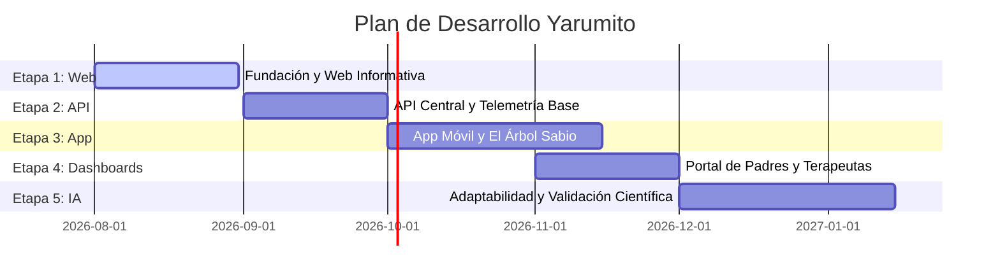

# Hoja de Ruta de Desarrollo - Ecosistema Yarumito 🌳

Para asegurar un desarrollo ordenado y fluido, el ecosistema Yarumito se implementará en **5 etapas cronológicas**. El enfoque inicial de esta fase de creación es la **Etapa 1: Fundación y Web Informativa**, que servirá de plataforma de donación y comunidad.

---

## 🗺️ Fases del Proyecto

---

## 📋 Detalle de las Etapas

### Etapa 1: Fundación y Web Informativa (`web/`) 🎯 *Fase Actual*
El objetivo es construir el canal oficial para congregar voluntarios, recibir donaciones y proveer recursos iniciales fuera de la pantalla.
* **Componentes clave**:
  - **Página de Inicio**: Presentación de la misión de Yarumito y el funcionamiento del ecosistema.
  - **Módulo de Donaciones**: Integración de pasarelas de pago (Stripe/PayPal) para donaciones recurrentes y patrocinio de escuelas.
  - **Página de Transparencia**: Visualización automática de fondos recibidos, gastos y metas alcanzadas.
  - **Biblioteca de Imprimibles**: Portal de descarga de actividades analógicas en formato PDF para que padres y terapeutas trabajen de forma física (estimulando la motricidad).
  - **Espacio de Investigación**: Publicación de metodologías y colaboraciones universitarias.
* **Resultado final**: Un sitio web Next.js bilingüe (ES/EN) optimizado para SEO con soporte para donaciones activas.

---

### Etapa 2: API Central y Base de Datos (`api-central/`)
El objetivo es construir el núcleo inteligente que procesa las solicitudes de los clientes y almacena los datos de forma segura.
* **Componentes clave**:
  - Configuración del servidor FastAPI (Python).
  - Implementación del modelo de base de datos dividida (PostgreSQL para Auth y MongoDB para logs de juego).
  - Creación del sistema de autenticación de tutores y asignación de identificadores de juego anonimizados (`child_hash_id`).
  - Endpoints para servir el catálogo bilingüe de actividades didácticas.

---

### Etapa 3: App Móvil del Niño e Interacción (`app-movil/`)
El objetivo es crear el primer cliente interactivo puramente lúdico y sin estrés para los niños.
* **Componentes clave**:
  - Inicialización del proyecto móvil (Flutter/React Native).
  - Desarrollo del sistema visual de **El Árbol Sabio** (diseño y animación de los estados de crecimiento: semilla, brote, planta, árbol).
  - Integración de los motores de audio (síntesis de voz SSML bilingüe y receptor de comandos de voz).
  - Implementación del fondo animado calmo y la paleta de colores pasteles para la accesibilidad neurodiversa.
  - Telemetría básica de eventos de juego enviada a la API Central.

---

### Etapa 4: Dashboards de Acompañamiento (`dashboard/`)
El objetivo es dotar a los adultos (padres, maestros, terapeutas) de herramientas para guiar y comprender el aprendizaje del niño.
* **Componentes clave**:
  - Panel de Padres: Visualización del crecimiento de la semilla a árbol, y descarga de guías impresas personalizadas.
  - Panel de Docentes y Terapeutas: Administración de grupos de niños, configuración de planes individuales y alertas de progreso.
  - Sistema de retos familiares ("Pregúntale a mamá/papá").

---

### Etapa 5: Inteligencia Artificial Adaptativa e Investigaciones 🔬
El objetivo es activar el motor de recomendación inteligente en tiempo real y habilitar la exportación de datos científicos.
* **Componentes clave**:
  - **Algoritmo de recomendación adaptativo**: Generación de caminos de aprendizaje basados en el perfil cognitivo multidimensional del niño.
  - **Clasificador de Fatiga y Frustración**: Monitoreo de velocidad de respuesta y patrones de error para sugerir pausas activas.
  - **Exportador Científico**: Panel para investigadores con datasets 100% anonimizados de interacción infantil para estudios de efectividad de aprendizaje.
